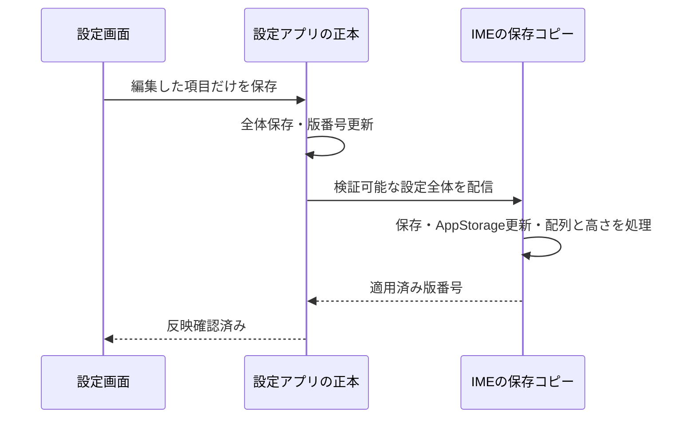

# 設定保存とIMEへの反映

## 対象と責任

通常設定は `KeyboardSettingsSnapshot` に集約する。使用言語と共通配列、フリック切り替え、フリック感度、長押し時間、キーのプレビュー、キー間隔、振動、ショートカットの順序、高さを含む。

- **Model**: 設定の型、既定値、値の検証、差分の適用を管理する。
- **Repository**: `settings_record_v1` に設定全体を一度に保存する。IMEでは正本の受信済みコピーと未同期の変更を同じレコードに保存する。保存成功後にAppStorageへ反映する。
- **Sync**: 同一アプリに限定した共通イベントで取得・変更要求・配信・反映確認を処理する。
- **Receipt**: 通常設定、IME側の変更要求、背景画像について、保存済み・確認待ち・反映済み・通信失敗を同じ規則で扱う。

設定アプリが正本を持ち、版番号を採番する。UIやキー処理からPreferencesやPersistentStorageへ直接保存しない。従来の `KeyboardConfig` の読み込み関数は、互換用の窓口として同じ有効設定を参照する。

## 通常の保存

保存成功と通信成功は別に扱う。通知が失敗したり2秒以内に確認が返らなくても、保存した設定は保持する。画面には同期待ちを表示し、再試行できる。IME起動・キーボード再表示・設定画面の起動と復帰で設定を取得する。

IMEが反映確認を返すのは、受信データを検証し、保存とリアクティブ状態の更新を行い、IME側の適用コールバックが完了した後。配列変更に必要な入力処理が完了しなければ確認を返さず、次の取得時に再評価する。画面上の全ピクセルの描画完了を保証する通知ではない。

## IME側からの変更

言語のオン／オフ、配列キー、高さの決定も `keyboardSettingsSync.save()` を使う。IME側では変更を保存してその場で利用し、正本へ差分を送る。設定アプリが停止中でも自動的に前面起動せず、未同期の変更を保持する。

変更は永続的な送信元IDと連番で管理する。送信するのは先頭の1件だけで、未送信の後続変更は1件にまとめる。送信済みの内容は変更しない。正本は送信元ごとの適用済み連番を保存し、重複通知を再適用せず現在の設定と確認番号を返す。IMEは確認済みの変更だけを削除する。別の設定項目を上書きしないよう、正本には全体ではなく編集した項目の差分を渡す。

送信が途切れた場合の再送は最大3回。その後も未同期データは保持し、次の起動・再表示・手動再試行で再開する。受信した正本の版が古い場合は設定全体を巻き戻さない。未同期の差分は、新しい正本へ重ねて利用する。

## 背景画像

画像・GIFと見た目の調整値は既存の分割転送を維持し、通常設定の小さな通知には含めない。保存とACK待ちは共通のReceiptで管理する。画像の保存が成功し転送だけ失敗した場合は「保存済み・反映待ち」とし、最後の保存済み画像を保持する。IMEの取得要求で転送を再開する。一時プレビューと保存済み背景は別に扱う。

## 旧設定の引き継ぎ

旧GSKVの項目とPersistentStorageを初回に読み込み、検証・正規化した設定全体を保存する。移行が保存できた後だけ、通常設定の旧PersistentStorageの連動を解除する。現在の入力言語の記憶やクリップボードのデータは設定全体とは別に維持する。

旧版でIME側に保存されていた高さや使用言語は、最初の同期で設定アプリへ引き継ぐ。既に新しい設定として明示的に変更した値を移行で戻さない。読み込みに失敗した新形式のレコードを既定値で上書きせず、診断ログに失敗を記録する。

schema 1のキー間隔未定義のデータは受け入れ、コピー・読み取り時に既定値6を補う。既存の設定や未同期変更を破棄しない。キー間隔の変更は通常の差分保存と全体同期を使い、IMEのAppStorage更新から表示スタイルを再計算する。

## ログ

`config` に保存した版、適用した版、未同期件数、反映待ち、失敗コードを記録する。感度・時間・振動・高さなどの設定値は記録できるが、入力本文、候補、画像データやパスは含めない。保存した版とIMEの適用版が一致しているかを確認する。
